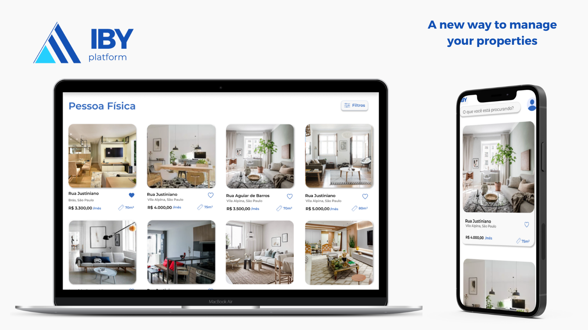

# IBY PLATFORM



## Our Team
- Bianca Cassemiro Lima
- Luiz Felipe Kama Alencar
- Marcos Aurélio Florêncio da Silva

## About Us

We are Software Engineering and Computer Science students at <a href="https://www.inteli.edu.br/">INTELI - Institute of Technology and Leadership</a>. We believe in the potential of blockchain to generate positive social and economic impacts.

## Our Solution

- Our solution seeks to facilitate the allocation of Union properties through the sale of NFTs to companies and real estate investment funds for a fixed period of 10 years. Each NFT grants the right to semi-annual use of the referenced property and can be resold to individuals or companies who want to rent residences or commercial properties.<br/>
- We believe that the value proposition is directed towards real estate companies and funds that adopt a business model of renovating and valuing properties. As it has resale value, individuals or companies who purchase such NFTs can observe gains in their investments at the time of resale. It is proposed that REITs can acquire ESG tokens by allocating 1% to 3% of the token value to a fund indicated by the SPU, with an equal counterpart from the Federal Government - this ESG initiative is enabled by the platform and can benefit the green finance segment, which preferably invests in initiatives that generate positive environmental effects.

## Value Proposition

### Customer Attributes
- Sale of non-fungible tokens tied to Union properties, through the Secretariat of Union Heritage, which could be the object of resale from the beginning to the end of the real estate chain, as acquiring funds and companies can adopt real estate appreciation models (i.e., retrofit) in more degraded properties and obtain adequate returns on the capital employed in this operation. In turn, individuals can eventually observe capital gains on their NFTs if the rental of the property in the region where it is located appreciates.

### Gains
- Positive free cash generation for the Union without increasing the tax burden
- Increased efficiency in the real estate market due to increased supply
- Positive compliance and data security effects
  
### Pains
- Difficulty in obtaining historical data from primary sources
- Infeasibility of monitoring due to resource limitations

### Pain Relievers
- Digitization of processes and data immutability
- Possibility of renting properties for more customized periods
- Possibility of capital gains for the end buyer

### Gain Creators
- Transaction transparency
- Information immutability
- Cost reduction

### Products and Services
- Iby real estate management platform, which allows the auction of primary and secondary sales of tokens that entitle the use of a property for a specified period.
 
## Technologies
This project was developed in JavaScript and Solidity and used the following technologies:

### Blockchain:

- Alfajores
- Ethers
- Hardhat
- OpenZeppelin
- IPFS

### Frontend:

- React
- Next
- SaaS

### Backend:

- Node.js
- Express
- MongoDB

## Instructions

This section contains information about tasks required to operate the web3 API.

Try running some of the following tasks:

```shell
npx hardhat help
npx hardhat test
REPORT_GAS=true npx hardhat test
npx hardhat node
npx hardhat run scripts/deployContracts.js
```

Use these commands to compile contracts:

```shell
npx hardhat compile
npx hardhat help compile
```

Set up and deploy to a local blockchain:

```shell
npx hardhat node
npx hardhat run --network localhost scripts/deployContracts.js
```

Interacting from the console

```shell
npx hardhat console --network localhost
```

This section contains data fields required for config.env file.

```shell

# default : development
# deploy config : production
NODE_ENV=development

# web3 tools
INFURA_API_KEY=<API_KEY>
GOERLI_PRIVATE_KEY=<PRIVATE_KEY>

# externally owned account
MNEMONIC=<MNEMONIC>
PRIVATE_KEY=<PRIVATE_KEY>
ADDRESS=<ADDRESS>
METAMASK_PASSWORD=<PASSWORD>

# server port
PORT=8000

# database config, remote and local
DATABASE_LOCAL=mongodb://127.0.0.1:27017/<PROJECT_NAME>
DATABASE_REMOTE=mongodb+srv://<USER>:<PASSWORD>@<CLUSTER>.<RANDOM>.mongodb.net/<PROJECT_NAME>
DATABASE_PASSWORD=<PASSWORD>

# user authentication and authorization
JWT_SECRET=<SECRET>
JWT_EXPIRES=90d
JWT_COOKIE_EXPIRES=90

```

## License

Distributed under the MIT License. See  `LICENSE`  for more information.